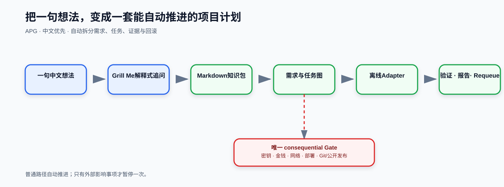

# Adaptive Project Governance (APG)

Turn one idea into an automatically advancing, verifiable project plan.

APG is a beginner-friendly, idea-to-result coordinator for AI coding. It clarifies natural-language requests, creates project Markdown knowledge packs, orchestrates tasks, and preserves evidence, Gates, and rollback.

## Flow

Idea -> Grill Me -> Markdown knowledge pack -> Task graph -> Offline adapter -> Validate / report

- Editable draw.io source: docs/diagrams/APG_GITHUB_INTRO.drawio
- Chinese overview: README_CN.md
- Validation summary: docs/validation/APG_PROJECT_VALIDATION_20260902.md

The published files document APG governance and validation fixtures only. They do not claim publication of the downstream child product.

Grill Me attribution: https://github.com/mattpocock/skills
