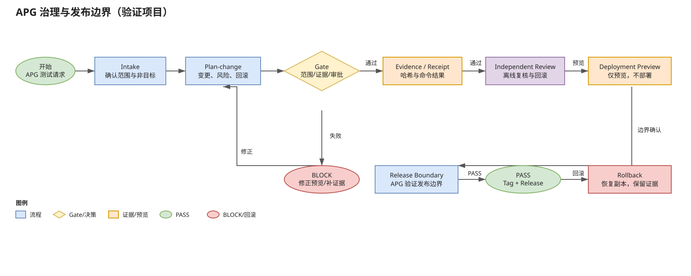

# APG：让小白也能轻松面对 AI Coding

> **中文为主｜English follows**

Adaptive Project Governance（APG）面向普通小白和初学者：用户只需要用自然语言提出一个 Coding 项目想法，APG 就会主动把模糊需求整理成可执行、可验证、可回滚的项目路径。

## 你只需要说出想法

APG 会先用 **Grill Me** 自然语言追问，把目标、用户、平台、约束、预算、风险和验收标准问清楚；不会让初学者自己填写复杂表格，也不会把用户变成审批 relay。

## APG 会自动整理什么

根据不同项目类型，APG 会生成并绑定一组适合的 Markdown 文献和治理资料，例如：

- `PROJECT_BRIEF.md`：项目简报与目标；
- `PRODUCT_PLAN.md`：产品计划、范围与里程碑；
- `UX_FLOW.md`：用户流程与交互；
- `ARCHITECTURE.md`：架构与模块边界；
- `STACK_DECISION.md`：技术栈决策与依据；
- `TASK_GRAPH.md`：需求拆分、依赖和执行波次；
- `QUALITY_PLAN.md`：测试、质量 Gate 与验收；
- `DEPLOYMENT_PLAN.md`：部署预览、发布边界与回滚；
- `PRG plan / memory / agents / design`：按项目需要生成的规划、记忆、代理协作和设计文档。

## 从需求到落地

1. **提出想法**：用日常语言描述你想做的 Coding 项目。
2. **Grill Me 澄清**：APG 追问真正会改变范围、风险或验收的关键问题。
3. **形成文档**：将答案整理成结构化 Markdown 资料，并保留来源证据。
4. **拆分需求**：把目标拆成任务、依赖、Gate、证据和回滚步骤。
5. **分波次执行**：自动安排可安全执行的工作；遇到外部发布、生产数据、凭据或不可逆动作时只提出明确的单一 Gate。
6. **验证并交付**：运行检查、独立复核、生成结果证据，最终帮助项目落地。

## 可视化总览



可编辑源文件：[`diagrams/APG_GOVERNANCE_RELEASE_FLOW.drawio`](diagrams/APG_GOVERNANCE_RELEASE_FLOW.drawio)

---

## English summary

APG helps beginners face AI coding with a simple natural-language project request. It **Grill Me**-clarifies the idea, generates project-specific Markdown artifacts (brief, plan, memory, agents, design, architecture, task graph, quality and deployment plans), decomposes requirements, orchestrates bounded execution waves, and preserves evidence, Gates, and rollback. Consequential external actions remain explicit transaction boundaries.

# Project Governance Operator Guide

This directory documents the approved Version 1 Adaptive Project Governance contract: repository-scoped, audit-first, evidence-producing, and reversible. Governance reduces regression risk, limits blast radius, preserves rollback, and retains evidence; it cannot promise zero bugs or prove the absence of defects.

## Scope and authority

- `.governance/project.toml` is the reviewed project profile.
- `.governance/policy.toml` is the canonical policy.
- `.governance/baseline.json` stores accepted finding fingerprints and measurements.
- `.governance/changes/<change-id>.json` stores intent, impact, approvals, rollout, telemetry, and rollback.
- `.governance/receipts/<timestamp>-<command>.json` stores immutable command evidence.
- `.governance/architecture.graph.json` is optional reviewed topology evidence, not a Gate execution plan.
- `.governance/consistency.manifest.json` is optional reviewed artifact-relationship evidence, not a generator or repair plan.
- `.governance/current-state.md` is generated, replaceable, and not authoritative.
- TOML is reviewed configuration; JSON is machine-produced evidence.
- Unknown schema major versions fail closed before writes.

The controller is technology-neutral, has no resident daemon, and does not dictate framework, language, architecture, or repository layout. Global activation for future projects or user-wide Codex, Claude Code, Cursor, or launcher configuration is outside Version 1 and requires separate authorization.

## Beginner autonomy

APG plans, validates, and performs routine bounded local work without turning a
beginner into an approval relay. Simultaneous consequential reasons within one
exact transaction are grouped into at most one real owner Gate. A confirmed
authorization session may cover only its pre-bound child transactions when they
share one exact source, required preimage, scope, and reason set. A P3-G session
also names one lifecycle run, plan, wave, and `CONFIRM` task set. Any drift or
new external boundary remains a new `CONFIRM` or `BLOCK` outcome.

## Six operations

| Operation | Contract |
|---|---|
| `init` | Profile and initialize a new project with bounded, additive, idempotent writes. |
| `audit` | Strictly read-only inspection; does not create `.governance/` in an unadopted target. |
| `adopt` | Requires an approved audit receipt; applies approved additive controls, records baseline, verifies adapters, and runs relevant checks. |
| `plan-change` | Previews a consequential change by default; apply requires the applicable approval and rollback information. |
| `check` | Runs configured fast, full, or release gates. |
| `doctor` | Diagnoses policy, adapter, baseline, conflict, and evidence problems without silent replacement. |

`audit` is not adoption. Preview is not apply. Structural migration is a separate approved `plan-change` with acceptance tests, staged rollout, telemetry, and rollback. A large file is a review signal, not proof that it must be split.

## Five results and stable exits

Every gate returns exactly one state: `pass`, `warn`, `fail`, `inconclusive`, or `not-applicable`. `inconclusive` never counts as pass; timeout, crash, unavailable tool, and decode failure are inconclusive.

- `0`: pass
- `1`: deterministic failure
- `2`: invalid invocation or schema
- `3`: inconclusive required evidence
- `4`: authorization or scope violation
- `5`: partial-write recovery required

## Quality gates

- **Fast:** scope, schema, adapter digest, secret checks, configured lint/type/compile checks, unit tests, bug-reproducing tests, and affected public-contract checks.
- **Full:** fast plus broader and dependency-aware tests, integration and contract tests, build/package, baseline, dependency/license/security, migration, and relevant performance checks.
- **Release:** fast and full plus production artifact, provenance/reproducibility, compatibility, security, performance, deployment, telemetry, staged rollout, rollback readiness, and approvals. G4 may require independent verification and recovery rehearsal.

## Gate execution provenance

Canonical CLI `check` on an adopted project binds every check receipt to the
SHA-256 of the canonical `.governance/policy.toml` that supplied the executed
Gates. The CLI fails closed when that authority is missing or changes before
  execution, and rejects policy paths that contain a symlink, reparse point, or
  root-external final handle. The default selector remains phase: `fast`,
  cumulative `full`, or cumulative `release`. An adopted project with a valid
  P1-D plan may instead use the explicit, mutually exclusive `--plan-receipt`
  selector described below. Gate order and required/warning semantics are
  unchanged.

Normal and scope-violation check receipts include a closed Gate execution
evidence projection with schema version `1.0`. Each entry records the Gate
identity, phase, kind, required flag, result status, stable reason code, nullable
process exit code, SHA-256 of the full semantic Gate contract, SHA-256 values for
redacted stdout/stderr captures, observed and captured byte counts, truncation
flags, and duration. Contract hashing covers the complete declared Gate
semantics, while only the digest is persisted. Capture hashing occurs after
redaction and hashes only the capture's character-class shape, so unrecognized
literal values are not exposed through an exact-content verifier.

Raw argv, commands, command output, environment values, file contents, and
secrets are never persisted in this evidence. The full contract digest is an
exact equality verifier for the public policy semantics, so Gate policy must
never embed credentials or other low-entropy secrets; known credential-bearing
arguments, fields, and literals fail before execution. Treat policy and receipts
as governance evidence rather than a secret store. The public `run_gate` return type
and the top-level Receipt and CheckResult schemas remain unchanged. A direct
`run_check` API compatibility path may omit policy binding for unmanaged or
internal use, but canonical CLI checks of adopted projects may not opt out.

Phase mode records `selection_mode = "phase"`; plan-bound mode records
`selection_mode = "plan"` and uses the recomputed effective phase. Neither mode
accepts raw planned Gate IDs. A plan receipt can select execution only after the
controller authenticates and exactly recomputes the complete P1-D projection.

## Optional architecture impact graph

An adopted project may provide the optional canonical file
`.governance/architecture.graph.json`. Its closed `1.0` schema contains exactly
`schema_version`, `nodes`, `edges`, and `always_gate_ids`. Nodes declare a stable
ID, closed kind, project-relative path prefixes, owner, and Gate IDs. Directed
`depends_on` edges state that `dependent` uses `dependency`. The graph is bounded
to 1 MiB, 256 nodes, 1,024 edges, 32 path prefixes and 32 Gate IDs per node, and
32 always-on Gate IDs.

Changed paths map to one owner by deterministic longest path-prefix match.
Hierarchical prefixes are allowed; exact prefix ownership by multiple nodes is
invalid. Impact starts with directly matched nodes and follows the transitive
reverse dependent closure, so changing a dependency includes every bounded
dependent. The plan-change receipt preserves all legacy impact fields and, only
when the graph exists, adds `impact.architecture_graph` evidence with graph
digest/counts, direct and affected nodes, candidate Gate IDs, unmapped or
ambiguous paths, cycle information, unknown Gate IDs, traversal exhaustion, and
`fallback_full`.

`candidate_gate_ids` and `fallback_full` are evidence, not execution controls.
Plan-change does not select, skip, run, reorder, or waive a Gate. Unmapped or
ambiguous paths, unknown configured Gate IDs, cycles, or exhausted traversal set
`fallback_full = true`; they never produce an empty-success claim. If the graph
is absent, Doctor adds no warning or failure and plan-change retains its exact
legacy impact shape without an `architecture_graph` key. Doctor validates a
present graph read-only and reports rather than repairs it. The controller does
not infer the graph from source, generate it automatically, or create downstream
project graphs or diagrams.

## Optional declared consistency manifest

An adopted project may provide the optional canonical file
`.governance/consistency.manifest.json`. Its closed `1.0` schema declares
reviewed relationships rather than discovering them. A `source_generated`
relationship names one `source_path` and one or more `generated_paths`; a
`cross_surface` relationship names symmetric `paths`. Every relationship has a
stable `relationship_id`, its `kind`, and `comparison = "exact_bytes"`, the only
comparison supported in Version 1.

The manifest is bounded to 1 MiB, 128 relationships, 16 members per
relationship, 512 globally unique member paths, 256 Unicode characters per
path, 8 MiB per member file, and 64 MiB of aggregate declared member bytes per
evaluation. Members must be normal, root-contained project files. Unsafe,
aliased, duplicate, symlinked, governance-evidence, missing, oversized, or
otherwise unevaluable members fail validation; a declared mismatch is drift,
not equivalence.

If the manifest is absent, Doctor adds no diagnostic and plan-change preserves
its legacy impact shape. If it is present, Doctor evaluates it read-only and
reports valid matching relationships as pass or malformed, missing, or drifted
relationships as fail. Plan-change adds only nested
`impact.consistency_manifest` evidence for declared relationships touched by the
request. It may report the manifest digest, affected relationship IDs and member
    paths, omitted counterparts, and each affected relationship's current
    pass/drift/missing status, but it does
not add those counterparts to `changed_paths` and does not select, skip, run,
reorder, or waive a Gate.

The controller does not generate, repair, normalize, or infer a manifest or any
declared artifact. Exact-byte agreement does not prove generator correctness,
source authenticity, or build reproducibility; those claims require their own
configured evidence and Gates.

## Conservative affected-Gate planning

Plan-change adds the closed
`impact.affected_gate_plan` schema `1.0`. This is an execution-free recommendation
bound to the canonical policy plus optional graph and consistency-manifest SHA-256
values. A missing graph is represented by `architecture_graph_sha256 = null`; it
deterministically uses `mode = "fallback_full"`, promotes the effective phase to at
least `full`, and plans every cumulative eligible policy Gate without omissions.
The plan reports the risk-required and effective phases, declared and derived
planning paths, direct and affected nodes, candidate, eligible, planned, omitted,
unassigned, and unsafe Gate IDs, stable fallback reasons, and
`execution_performed = false`. Gate commands, options, environment values, file
contents, and secrets are not projected.

Consistency endpoints may extend `planning_paths`, but never the ChangeRecord
`changed_paths`, approval scope, authorized writes, or P1-A architecture impact
evidence. Effective phase is monotonic: it cannot be lower than the risk-required
phase and rises to a higher candidate phase. Unmapped or ambiguous paths, cycles,
unknown Gates, exhausted bounds, empty candidates, unassigned eligible policy
Gates, or non-passing consistency relationships use `mode = "fallback_full"`
and recommend the complete cumulative Gate set for at least the full phase.
Missing policy authority, no eligible Gate, unsafe Gate identity, or an output
bound that prevents a complete recommendation uses `mode = "inconclusive"`,
never empty success. Proven bounded coverage uses `mode = "affected"`.
Changing `.governance/policy.toml`, `.governance/architecture.graph.json`,
`.governance/consistency.manifest.json`, or an ancestor path is also
inconclusive: the pre-change authorities cannot prove the post-change Gate set,
so plan-change must be rerun after the authority change is applied.

Planning itself remains execution-free: it does not select a live check, run,
reorder, waive, or mark a Gate not applicable. Only an applied canonical plan
receipt can later enter the separately explicit plan-bound check path. Graphless
plan-bound execution authenticates and recomputes the same policy-bound fallback,
records a null graph digest, and retains stale-policy, receipt-ledger, scope, and
first-failure-stop checks.

## Plan-bound Gate execution

`check TARGET --plan-receipt .governance/receipts/RECEIPT.json` is available
only for adopted projects. The reference must name one canonical, regular,
non-linked, non-hardlinked in-project `plan-change` receipt whose filename and
canonical receipt digest agree. Before any Gate runs, the controller verifies
the receipt envelope and closed plan shape; the matching canonical
ChangeRecord; input, evidence, authorization, risk, phase, and approval fields;
and the current policy, architecture graph, and optional consistency manifest
digests. It then recomputes P1-D planning from those current authorities and
requires exact equality with the stored projection. The stable plan selection is
read twice before execution. After those reads and before any Gate, the
controller inventories the complete `.governance/receipts` ledger. The bounded
inventory accepts at most 10,000 entries, at most 1 MiB per receipt, and at most
64 MiB of aggregate receipt bytes. Every entry must be one root-contained,
regular, non-linked, non-reparse, non-hardlinked, stably read canonical Receipt
1.x file. An invalid, unreadable, unsafe, or exhausted ledger fails with exit
`2`, before Gate execution, and persists no check receipt.

Canonical historical receipts remain valid regardless of age. The ledger
inventory validates their persisted Receipt envelope and bytes; it does not
reinterpret historical approvals or outputs against current policy. Only the
selected plan-change receipt is revalidated with its matching ChangeRecord and
the current plan authority.

`mode = "affected"` executes exactly the recomputed planned Gate set.
`mode = "fallback_full"` executes the complete cumulative eligible set.
`mode = "inconclusive"` executes no Gate and returns exit `3`. Selected Gates
remain in canonical phase and Gate order and each produces one normal CheckResult
and one P1-E0 provenance entry. Omitted Gate IDs are recorded only as not
executed; they are never represented as pass, waived, or not applicable.

The receipt adds a closed `plan_bound_execution` object with the plan receipt
reference and hashes, ChangeRecord hash, change ID, mode, effective phase,
policy/graph/manifest hashes, planned/executed/omitted Gate IDs, fallback reason
codes, `execution_performed`, and `authority_status`. After execution the
controller reloads policy and recomputes the complete selection. It also
re-inventories the ledger and compares its in-memory fingerprint with the
pre-execution inventory. An invalid post-run ledger or any fingerprint drift is
a receipt-ledger scope violation even when the selected plan authority is still
stable. Any concurrent plan, ChangeRecord, receipt-ledger, authority, or
workspace change returns exit `4` with scope-violation evidence and does not
persist a successful check receipt. This bounded before/after guard detects
drift; it does not provide locking, leases, or atomic replacement, which remain
P1-E2 work. `--plan-receipt` is mutually exclusive with explicit `--phase` and
cannot be combined with `--loop-run`. Legacy phase and feedback-loop behavior is
unchanged and does not acquire this new ledger precondition.

## Existing refactored projects: B route

1. **Audit** the architecture, contracts, commands, dependencies, release surfaces, governance files, Git state, licenses, provenance, secret exposure, performance signals, and failures; distinguish evidence from inference.
2. **Classify** each area as `Retain`, `Add`, `Decide`, `Measure`, or `Migrate`.
3. **Adapt** policy to observed boundaries and add only approved controls.
4. **Preserve conflicts:** surface conflicting rules to `doctor`; never silently merge, replace, or downgrade them.
5. **Approve adoption** from the audit receipt, record reproducible legacy baselines, verify adapters, and run relevant checks.
6. **Migrate separately** through an approved `plan-change` when concrete coupling, reliability, performance, security, or maintainability evidence supports it.

The quality ratchet permits known reproducible legacy failures but blocks new or worsened failures. Baselines cannot waive secret leakage, unauthorized writes, data-integrity corruption, or another configured non-baselinable rule.

See `POLICY_REFERENCE.md` for every canonical field and `PILOT_RUNBOOK.md` for the pilot sequence.

## Prerequisites and command use

Run the standard-library controller from the repository with Python:

```powershell
python -X utf8 -m project_governance --help
```

Before a write, confirm the target root, authorized scope, owner, approval path, and native project commands. The controller does not invent build, test, lint, type, package, release, deployment, or performance commands. The public commands and their documented flags are:

```text
project_governance audit TARGET [--receipt-dir RECEIPT_DIR] [--json]
project_governance init TARGET [--policy-file POLICY_FILE] [--apply] [--json]
project_governance adopt TARGET --audit-receipt AUDIT_RECEIPT --audit-digest AUDIT_DIGEST --approval APPROVAL [--policy-file POLICY_FILE] [--apply] [--json]
project_governance plan-change TARGET --request REQUEST [--apply] [--json]
project_governance check TARGET [--phase {fast,full,release}] [--loop-run LOOP_RUN] [--json]
project_governance check TARGET --plan-receipt PLAN_RECEIPT [--json]
project_governance doctor TARGET [--json]
```

`init`, `adopt`, and `plan-change` preview by default; `--apply` is the explicit write switch for those commands. `audit` is read-only and does not create `.governance/` in an unadopted target. `--json` emits one canonical JSON receipt. `init` and `adopt` accept an owner-reviewed canonical TOML policy through `--policy-file`. The supplied policy cannot lower the audit or embedded-policy governance floor or omit any document selected by those authorities. A `G2`, `G3`, or `G4` policy must contain at least one valid canonical Gate; owner-supplied policies and non-G1 embedded policies must also contain a command Gate for adapter projection, so the controller never invents a project command. Rejection occurs before a transaction is created. An empty adapter list retains the Version 1 Codex default used by Doctor. `adopt` additionally requires an approved audit receipt, its expected digest, and structured project approval. G1 retains the legacy generated or embedded-policy path. Preview is not apply, and audit is not adoption.

## Receipts and adapters

Receipts retain command inputs and outputs, policy and target digests, authorized scope, findings, checks, approvals, classifications, and evidence references. Receipt 1.x has one strict loader shared by CLI adoption and Doctor: the envelope and nested finding/check fields are closed, commands and UTC timestamps are validated, duplicate JSON keys fail, and persisted receipt bytes must equal canonical JSON. A canonical historical receipt remains immutable evidence regardless of age; age alone never makes it invalid, and Doctor does not delete, archive, rewrite, or migrate receipt history. An operation may still require fresh audit evidence before a new adoption without invalidating the older receipt. Init/adopt receipts also record policy input status, Gate IDs, Gate kind/phase and argument counts, planned documents, and configured adapters; raw command arguments are not copied into this summary. After adoption, receipts live under `.governance/receipts/`; for an unadopted audit, use standard output or `--receipt-dir` outside the target.

`.governance/current-state.md` is optional, replaceable, and non-authoritative. When present it is TOML-compatible Markdown containing a canonical source receipt reference and SHA-256 plus exact SHA-256 entries for the projected governance files. Doctor accepts absence, passes a current projection, warns on stale links or digest drift, and fails only when the underlying receipt evidence is invalid. It never creates or repairs this projection. Managed projections are adapters, not independent policy sources. Configured adapters may project controls to Codex `AGENTS.md`, Claude Code `CLAUDE.md`, Cursor scoped `.cursor/rules/`, Git fast-check hooks, or GitHub integration/release checks. Each projection records policy/source digests, generator version, and scope; `doctor` detects missing, stale, manually edited, duplicated, or divergent projections.

Feedback-loop checks remain opt-in and write only normal check receipts. The
optional `check --loop-run LOOP_RUN` path accepts the closed loop-run fields plus
optional `progress_evidence`.
When present, progress evidence contains exactly `metrics: [{id, value}]`,
`acceptance: [{id, status}]`, `incidents: [id]`, and `owner_decision_code`. The
acceptance statuses are `pass`, `fail`, `inconclusive`, and `not_applicable`; owner
decision codes are `none`, `continue`, `revise`, `defer`, and `stop`. IDs are
bounded code tokens, metric values are finite numbers, duplicate IDs and unknown
fields fail before any Gate runs, and free-form feedback is not accepted. Numeric
canonicalization makes `1` equivalent to `1.0` and `0` equivalent to `-0.0` for
the progress fingerprint.

Historical loop receipts without `progress_evidence` are read as empty metrics,
acceptance, and incidents with owner code `none`. For every canonical receipt in
the selected chain, the controller recomputes the stored progress fingerprint from
that receipt's checks and feedback-loop input; mismatches, broken links, branches,
and cycles fail closed. Owner decision codes are fingerprint evidence only: they
grant no approval and do not change or override `stop_state` or `next_gate`. Raw
feedback, logs, prompts, PII, and secrets are not persisted. The progress
fingerprint is separate from regression identity: P0-E metrics, acceptance,
incidents, and owner decision codes never enter a regression `candidate_id`.

New check receipts retain legacy `symptom_codes` and also emit
`candidate_schema_version = "2.0"` with a closed `candidates` array. Each
`candidate_id` binds the symptom code to a safe Gate contract digest and a
receipt-safe evidence digest. The receipt also stores an independent closed
`regression_gate_contracts` snapshot. Source validation requires each failed or
inconclusive check to have exactly one candidate and requires that candidate's
contract to match the independent snapshot. A proposal contains at most 64
candidates and a snapshot at most 256 contracts; generation and parsing enforce
the same limits before Receipt persistence. The Gate projection contains only
Gate ID, phase, kind, required flag, timeout, warning codes, argv count, and
option-key names; it never copies command arguments, option values, or
environment values. Evidence identity accepts normalized, bounded UTF-8 project
locators, including common filename punctuation and spaces. Scope-normalized
changed paths may also include single-segment directory paths. Backslashes
normalize to `/`; a root locator `.` becomes `project.root`.
References redacted by the receipt boundary become deterministic count-based
sentinels such as `redacted/evidence-001.ref` before hashing. Candidate evidence
never copies a check message, stdout, stderr, logs, prompts, feedback, PII,
secrets, or file content. When a Gate supplies no evidence references, the
evidence projection remains empty.

Persisting any proposed regression remains a separate approved
`plan-change --apply`. Legacy Ledger/Update `1.0` continues to select a
`symptom_code` and use
the legacy symptom fingerprint. Ledger/Update `1.1` selects the exact
`candidate_id` from the source check receipt and stores it as the record
fingerprint and filename. Existing `1.0` records are not migrated or rewritten,
and updates cannot cross versions. `doctor` validates canonical record bytes,
filename/fingerprint agreement, the source candidate, and Gate/evidence digests;
it reports drift without repairing it. Regression records otherwise retain only
constrained codes, receipt references, recurrence count, owner/status/next gate,
and typed project-relative permanent assets. Closing a record requires an
existing permanent asset.

Profiles are discovered and written as `.governance/project.toml`; the canonical policy is `.governance/policy.toml`. Profile evidence selects level `G1`–`G4`, conditional required documents, adapters, gates, and non-baselinable rules. Conditional documents are selected from the observed project type, lifecycle, exposure, data risk, release model, and test burden; do not assume every project needs every document.

For large AI, media, or monorepo targets, read-only audit hashes normal source and
governance files while representing dependency, model, VCS-object, and generated
subtrees with bounded directory metadata. The receipt names this proof mode and
lists every pruned directory name. Those generated subtrees are outside content
inspection; initialization, adoption, and all transactions continue to use exact
write scopes and full rollback checks.

The `.git` directory uses a stable presence sentinel because read-only Git status
may refresh index locks and timestamps. Worktree content remains fingerprinted;
the audit receipt records this narrower VCS metadata boundary explicitly.

Adoption replays the snapshot mode declared by the audit receipt before comparing
the target fingerprint. Receipts from the earlier full-snapshot proof remain
loadable when they do not declare a proof mode; unknown or drifted proof contracts
are rejected.

## Pilot boundary and limitation

Pilot work is audit-first: retain the read-only receipt, review evidence, classify `Retain`/`Add`/`Decide`/`Measure`/`Migrate`, preview adoption, obtain explicit approval, apply only additive controls, verify adapters and gates, and retain rollback/recovery evidence. Do not change Git state or global Codex, Claude Code, Cursor, launcher, daemon, or background settings as part of Version 1. Structural migration is a separate approved change. The framework reduces regressions and improves prevention, detection, containment, and recovery, but it cannot promise zero bugs.

## P2-A structured project intake

P2-A adds the standard-library-only `project_governance.intake` module. It is an
in-memory evidence contract for the later Grill and routing slices; importing,
parsing, and rendering it performs no filesystem writes, network calls,
dependency discovery, approval creation, or target mutation. The public API is
`parse_intake(payload: bytes) -> ProjectIntake` and
`render_intake(record: ProjectIntake) -> bytes`.

The extension is closed at `extension_schema_version = "1.0"`. A top-level
record contains only `intake_id`, `project_mode`,
`project_mode_evidence_refs`, `purpose`, `user_context`, `remediation_level`,
`stack_fitness`, `need_evidence_level`, `slice_complexity`, `decisions`,
`evidence`, and `stop_state`. Nested records are frozen dataclasses and their
collections are tuples. Unknown fields, duplicate object keys, duplicate
record IDs, unsupported enum values, non-canonical array order, and mutable
record shapes are rejected before a record is returned.

The routing enums are deliberately small:

| Dimension | Values |
|---|---|
| Project mode | `new`, `existing`, `ambiguous` |
| Purpose | `personal-learning`, `real-audience` |
| Decision disposition | `D` (default), `V` (verify), `B` (human-bound) |
| Remediation | `L0` through `L4` |
| Stack fitness | `S0` through `S4` |
| Need evidence | `T0`, `T1`, `T2` |
| Stop state | `continue`, `ready-for-preview`, `owner-gate` |

`user_context` is limited to project relationship, self-declared domain
experience, self-declared technical experience, and audience mode. Each field
uses a closed vocabulary with an explicit `unknown` value where appropriate;
names, email addresses, account identifiers, credentials, customer records,
and unbounded conversation text are outside this contract.

Each decision has a stable ID, topic code, disposition, resolution state,
recommendation code, evidence references, bounded confidence, and user-impact
code. `ai-resolved` is valid only for `D` and `V`; a `B` item remains open or is
marked `user-confirmed`. Human-bound decisions consume a budget of three for a
simple slice or five for a complex current slice. AI-resolved `D`/`V` decisions
are reported separately by `ai_resolved_count` and do not consume that budget.

Evidence references are either bounded stable IDs or contained
project-relative paths. Traversal, absolute paths, query-bearing URLs, secret
patterns, control characters, oversized scalars, and excessive records are
rejected. Evidence kinds distinguish `hypothesis`, `public-research`,
`real-user-evidence`, `technical-viability`, `user-confirmation`, and
`project-evidence`. `T0` represents personal learning, `T1` requires public
research for a real-audience hypothesis, and `T2` requires real-user evidence.
These labels describe evidence quality; they do not assert that a hypothesis
is a product fact.

The stop state is derived and checked against unresolved decisions:

- `continue` means unresolved `D`/`V` items remain and no open `B` item exists.
- `owner-gate` means at least one open `B` item remains.
- `ready-for-preview` means all decisions are resolved.

An intake record is evidence only. It does not grant APG approval, authorize a
write, select a Gate, persist `.governance/intake/`, or replace an owner,
domain, or independent acceptance decision. APG `plan-change`, approvals,
bounded apply, Gate receipts, Doctor, and rollback remain separate authorities.
P2-A also leaves CLI commands, agent prompts, research execution, candidate
scoring, Domain Packs, packaging, global installation, promotion, host reload,
downstream projects, external services, dependencies, and Git operations to
later Change IDs.

## P3-A one-idea intake and decision routing

The beginner-facing promise is simple: say what you want to build once, then
answer only the questions that materially change the result. P3-A turns that
one idea into bounded, structured intent and a decision route. It composes above
the accepted P2-A intake, P2-B routing, P2-C stack, P2-D Domain Pack, and P2-E
guided-UX contracts; it does not replace or mutate them.

The caller may pass one trimmed NFC UTF-8 idea of at most 4 KiB to
`build_user_intent`. This is conservative deterministic keyword extraction, not
proof that APG understood arbitrary natural language. Unmatched or conflicting
concepts remain explicit uncertainty. `parse_user_intent` and
`render_user_intent` provide the separate canonical-byte contract for the
normalized result. P3-A keeps only normalized project facts: project type,
target platform, user persona, goals, constraints, uncertainty, and stable
evidence references. A normalized
intent contains no field for a raw prompt, conversation transcript, name, email
address, account or customer identifier, credential, access token, secret, or
customer record. Secret-shaped scalars, unknown fields, duplicate JSON keys,
unsupported enum values, traversal or absolute paths, non-canonical JSON, and
oversized records fail closed.

Every proposed decision has exactly one disposition:

| Disposition | Operator meaning |
|---|---|
| `AUTO` | APG may choose a reversible, bounded default because the evidence is sufficient and no mandatory confirmation trigger applies. The output records the decision, rationale, confidence, and evidence; it is not an approval to perform a side effect. |
| `RECOMMEND` | APG presents a preferred default with rationale, bounded confidence, and the consequence of choosing differently. The user may accept or override it, but P3-A does not execute the recommendation. |
| `CONFIRM` | The owner must make or explicitly accept the decision before dependent planning continues. APG may explain options and recommend one, but it may not silently convert the item to `AUTO` or treat absence of a reply as consent. |

`CONFIRM` is mandatory for cost or paid operations, production use, privacy or
personal-data handling, real customer or production data, provider or network
access, public publication, deployment, an irreversible external action, or a
materially ambiguous product direction. These triggers are monotonic: stronger
evidence may improve the recommendation, but cannot remove the owner gate.

The router output separates these fields rather than collapsing them into prose:

- `structured_intent`: normalized project type, target platform, persona,
  goals, constraints, uncertainty, and evidence references.
- `necessary_questions`: only unresolved questions whose answers can materially
  alter scope, product direction, risk, delivery, or acceptance.
- `recommended_plan`: bounded next-step recommendations suitable for later
  blueprint generation.
- `automatic_decisions`, `recommended_decisions`, and
  `confirmation_required_decisions`: disjoint decision groups with stable IDs.
- `rationale`, `confidence`, and `evidence_refs`: bounded support for the route;
  confidence communicates uncertainty and never upgrades evidence into fact.

The complete canonical record is limited to 64 KiB. IDs and codes are lowercase
ASCII tokens of at most 80 characters; evidence locators are at most 240
characters. Structured intent accepts at most 16 goals, 16 constraints, and 16
uncertainties. A route contains at most 16 necessary questions, 16 recommended
plan entries, 32 decisions across all three disposition groups, 64 evidence
references, and 16 evidence references on one item. Arrays use deterministic
ordering, confidence uses a closed bounded vocabulary, and rendering is stable
UTF-8 JSON with one trailing newline.

P3-A is a standard-library-only, in-memory evidence boundary. `route_user_intent`
computes dispositions from a validated `UserIntent`; callers cannot provide or
downgrade them. Parsing, classification, routing, and rendering perform no
filesystem writes, network or
provider calls, dependency discovery, approval creation, Gate selection,
runtime launch, publication, deployment, promotion, release, or downstream
project mutation. Caller-owned input bytes and returned canonical bytes are not
persisted by the module.

P3-A evidence may be supplied to a later P3-B Project Blueprint Generator. It
does not generate `PROJECT_BRIEF`, `PRODUCT_PLAN`, `UX_FLOW`, `ARCHITECTURE`,
`STACK_DECISION`, `TASK_GRAPH`, `QUALITY_PLAN`, or `DEPLOYMENT_PLAN`; P3-B
requires its own ChangeRecord, preview, authorization, Gates, acceptance, and
rollback. Public publication, global promotion, host/runtime activation,
provider/network acceptance, downstream pilot acceptance, deployment, and
release are also separate facts. None is proved by a P3-A parse, route, test,
Doctor result, or repository-local package result.

## P3-B project blueprint generation

The product direction remains **说出来一个想法，得到一个结果**. After P3-A
has structured the idea and separated `AUTO`, `RECOMMEND`, and `CONFIRM`, P3-B
turns an accepted route into exactly eight planning sections:
`PROJECT_BRIEF`, `PRODUCT_PLAN`, `UX_FLOW`, `ARCHITECTURE`, `STACK_DECISION`,
`TASK_GRAPH`, `QUALITY_PLAN`, and `DEPLOYMENT_PLAN`.

The generator is deterministic, immutable, source-hash-bound, standard-library
only, and side-effect-free. It requires `ready_for_blueprint=true` and no
confirmation-required decision. P2-derived routes remain blocked until their
complete source evidence can be serialized and recomputed canonically.
Recommendations remain assumptions, stack selection remains `needs-evidence`,
`ready_for_implementation` remains false, quality execution remains `not-run`,
and deployment authority remains `not-authorized`.

P3-B is an in-memory plan/evidence bundle. It does not create a downstream
project, execute tasks or Gates, choose or call a provider, install a dependency,
deploy, publish, promote, start a host/runtime, run a downstream pilot, or claim
release acceptance. See [PROJECT_BLUEPRINT.md](PROJECT_BLUEPRINT.md) for the
closed contract and later-phase boundary.

## P3-C implementation readiness resolution

P3-C follows P3-B and precedes a separately governed P3-D
materialization-preview stage. It deterministically binds the exact canonical
P3-B blueprint, canonical P2 `ProjectIntake`, original P2-C `StackCandidate`
records, complete P2-D Domain Pack registry and applicability evidence, P2-E
guided-intake inputs, and an explicit P3-A-to-P2 evidence relationship. It does
not infer identity from independent IDs or architecture compatibility from
similar names.

Parsing recomputes the complete result. It reparses every embedded source,
verifies canonical source digests, reruns `score_stack_candidates`, recomputes
guided-intake compatibility, derives applicable Domain Pack IDs and
professional Gate requirements, and rejects edited derived fields. The closed
first-match readiness states are `source-binding-required`,
`owner-confirmation-required`, `intake-evidence-required`,
`stack-evidence-required`, `stack-correction-required`,
`domain-evidence-required`, and `ready-for-materialization-preview`.

Only the final state sets `ready_for_materialization_preview=true`.
`implementation_authority` always remains `not-authorized`, and the resolver
never changes P3-B's `ready_for_implementation=false`. An unready state is
decision evidence, not an implementation failure or permission to fill gaps.

P3-C is offline, in-memory, standard-library-only, and side-effect-free. It
does not materialize a project, write a downstream root, execute a task or Gate,
install dependencies, call a provider or network, launch a host/runtime, run a
pilot, deploy, publish, promote, or release. P3-D requires its own ChangeRecord,
bounded changed paths, baseline, approval, Gates, rollback, and acceptance;
preview is not apply. See
[IMPLEMENTATION_READINESS.md](IMPLEMENTATION_READINESS.md) for the canonical
bindings, state precedence, failure posture, and rollback contract.

## P3-D project materialization preview

P3-D consumes an exact canonical P3-C readiness record and a complete,
caller-supplied downstream proposal. It binds the P3-C digest, embedded P3-B
blueprint digest, policy digest, root locator, manifest entries, pre-state,
approval state, configured Gates, acceptance references, and rollback plan.
It produces only a canonical preview with `preview_only=true` and
`apply_authority=false`.

Missing proposal facts become `pending-user-input`; malformed or non-ready
P3-C evidence becomes `block`; `preview-ready` is a review state only. P3-D
does not discover or write a downstream root, execute Gates, install a
dependency, call a provider or network, launch runtime, deploy, publish,
promote, pilot, release, merge, or push. See
[PROJECT_MATERIALIZATION.md](PROJECT_MATERIALIZATION.md) for the closed
contract and downstream authority boundary.

## P3-E materialization apply transactions

P3-E adds the repository-local transaction controller after P3-D. It validates
the frozen preview and supplied manifest bytes, classifies the action, and
performs bounded compare-and-swap writes only after the physical root and every
pre-state assertion are verified. The primary interaction is not a sequence of
approval forms: routine bounded and reversible local work is `AUTO`, safe
choices may be `RECOMMEND`, and the user sees the recommended path plus the
final evidence result.

`CONFIRM` is reserved for consequences the system cannot responsibly absorb:
provider or network access, cost or quota, credentials, real or production
data, public delivery, runtime launch, deployment, irreversible change,
security or privacy posture changes, and materially ambiguous direction. Such
an approval is transaction-scoped and binds the P3-D digest, physical-root
fingerprint, and exact write paths. Any unknown, drifted, unsafe, or
out-of-scope fact is `BLOCK`, never implied approval.

P3-E stores a separate pre-state snapshot, verifies content and post-write
hashes, and rolls back only while post-state still matches. It does not infer a
physical root from P3-D's logical root code, select a target, or itself access
a provider, network, runtime, deployment, publication, promotion, pilot, or
release surface.

## P3-F autonomous task orchestration

P3-F turns an exact ready P3-C record and its embedded P3-B task graph into a
deterministic recommended path. Each task receives one bounded execution
context with an executor, read and write scope, Gates, acceptance references,
rollback reference, and P3-E action context. Missing, extra, unsafe, or drifted
contexts fail closed.

Routine safe tasks are `AUTO`. Safe deferred choices are `RECOMMEND`.
Consequential P3-E boundaries, Git operations, and release are `CONFIRM`.
Unsafe or incomplete work is `BLOCK`. P3-F automatically moves overlapping
read/write ownership into later waves, so ordinary users are not asked to
manually reconcile routine parallel-lane conflicts.

The user-facing result is the recommended path, the next material tasks, any
genuine consequential confirmation, and one final `ACCEPT`, `INCOMPLETE`, or
`BLOCK` summary. Final `ACCEPT` requires complete Gate, acceptance, output, and
rollback evidence, accepted dependencies, and a reviewer identity distinct
from the executor. P3-F does not execute tasks or grant downstream, runtime,
deployment, publication, Git, pilot, or release authority. See
[AUTONOMOUS_TASK_ORCHESTRATION.md](AUTONOMOUS_TASK_ORCHESTRATION.md).

## P3-G goal-to-delivery lifecycle

P3-G turns the exact P3-F route into one resumable local lifecycle. It stores a
caller-supplied run ID, the exact P3-F plan digest, dependency-closed wave
cursor, task evidence, transaction-bound decisions and approvals, checkpoint
sequence/digests, consolidation references, and explicit phase acceptance.
Routine `AUTO` work advances without repeated owner interruption. `RECOMMEND`
pauses for one task-bound decision, `CONFIRM` pauses for one transaction-bound
approval, and unsafe or incomplete facts are `BLOCK`. Failed evidence stops the
run and blocks dependents. Exact checkpoint replay is idempotent; changed or
stale replay is rejected.

The ordinary user sees only a concise result and next step. Repository-local
evidence never becomes runtime, deployment, publication, promotion, pilot, or
release acceptance. P3-G remains standard-library-only and performs no
executor, Gate, filesystem, provider, network, credential, runtime, deployment,
publication, promotion, pilot, release, or Git action. See
[GOAL_DELIVERY_LIFECYCLE.md](GOAL_DELIVERY_LIFECYCLE.md).

## P3-H requirement trace and consolidation

P3-H turns one exact completed P3-G lifecycle into a deterministic
`REQ-* -> P3-A -> P3-B section -> task -> artifact` trace and one concise
combined result. It checks exact task coverage, output and consolidation
bindings, conflicting write ownership, residual gaps, current phase evidence,
and an independent consolidation review. A collection of individually passed
tasks is never treated as a compatible result without that reconciliation.

Routine work and trace assembly remain automatic. The ordinary-user result is
only accepted, needs-evidence, or blocked plus the current phase and next step.
P3-H never invents a missing decision, approval, conflict resolution, gap
closure, phase acceptance, or review. Repository validation remains distinct
from runtime, deployment, publication, pilot, and release acceptance. See
[REQUIREMENT_TRACE_CONSOLIDATION.md](REQUIREMENT_TRACE_CONSOLIDATION.md).

## P3-I idea-to-result session

P3-I composes the exact accepted P3-A, P3-B, P3-C, P3-F, P3-G, and P3-H
records into one resumable session. It verifies every source digest and stage
relationship, identifies the first unresolved stage, and returns one of
`auto`, `recommend`, `confirm`, `needs-evidence`, `block`, or `complete`.

This is the beginner-facing coordinator: routine local progression produces a
next step without another approval request, while a genuine consequential
boundary remains explicit and transaction-scoped. Only an accepted P3-H
combined result makes the session complete. P3-I does not run materialization,
tasks, Gates, runtime, deployment, publication, promotion, pilot, release, or
Git. See [IDEA_RESULT_SESSION.md](IDEA_RESULT_SESSION.md).

## P3-J non-invasive target project orchestration

P3-J binds one exact canonical P3-I `complete` session to a caller-supplied,
redacted target snapshot identified only by a stable logical `target_id`. It
derives requirement traceability, component decomposition, exact P3-F task and
wave orchestration, capability-preservation self-checks, independent review,
and an orchestration-scoped acceptance result.

Every declared existing capability defaults to `preserve`. A capability change
must name an explicit P3-H requirement and remains a separately governed
target-project transaction. Capability drift is `block`; missing preservation
evidence is `needs-evidence`; missing independent review leaves a complete plan
at `plan-ready`. `orchestration-accepted` accepts only the plan and preservation
evidence, not implementation or operation of the target project.

P3-J never receives a physical root or raw project content and performs no
filesystem, subprocess, network, credential, runtime, deployment, publication,
pilot, release, or Git action. `execution_authority`,
`target_mutation_performed`, and `execution_performed` remain false. See
[TARGET_PROJECT_ORCHESTRATION.md](TARGET_PROJECT_ORCHESTRATION.md).

## P4-1 host integration contract

P4-1 defines the acceptance plan for binding one exact APG build to one exact
plugin host. It separates host selection, installed-byte verification, reload,
bounded APG invocation, optional provider or network use, independent review,
and compare-and-swap rollback into distinct evidence and authority boundaries.

The contract is `planned` repository documentation only. It does not select or
modify a host, install or promote a plugin, reload a process, invoke APG, access
a provider or network, execute a target project, launch runtime, deploy,
publish, pilot, or release. Repository validation and installed files alone do
not establish host acceptance. See
[HOST_INTEGRATION_ACCEPTANCE.md](HOST_INTEGRATION_ACCEPTANCE.md).

## P5-A specification-driven beginner autonomy

P5-A adds a pure specification-convergence controller in
[`SPEC_DRIVEN_CONVERGENCE.md`](SPEC_DRIVEN_CONVERGENCE.md). It gives beginner
requests one deterministic path through clarification, a requirements-quality
checklist, cross-artifact planning analysis, prompt routing, and bounded
convergence. The controller recognizes `/plan`, `/clarify`, `/checklist`,
`/analyze`, `/converge`, and `/implement`.

The planning aliases receive automatic planning authority, so routine planning
does not become an approval queue. `/implement` can receive automatic execution
authority only for an exact-root, bounded, reversible, offline, secret-safe,
Gate-bound, rollback-bound local path proven by P3-E `ActionContext`. A safe
`RECOMMEND` default is selected automatically on that route. Network, provider,
credentials, cost, real data, runtime, deployment, security or privacy changes,
Git mutation, release, irreversible work, and material ambiguity remain
`CONFIRM`; missing root, scope, readiness, Gates, rollback, or secret safety is
`BLOCK`.

The generated package allows implicit invocation so a beginner's non-trivial
project request can reach APG. That metadata changes invocation only; it never
grants write authority or bypasses exact scope, evidence, CAS, rollback, phase,
host, target, runtime, deployment, publication, pilot, or release boundaries.

## P6-A continuity, progress, and loop harness

P6-A adds a separate, read-only status projection for the point where a terse
classification would otherwise leave an owner without a usable next step. A
project may declare `.governance/progress/active.json` as a canonical
`ProgressDefinition`. It lists the exact in-scope work packages, positive
integer weights, source digests, delivery boundary, and declared out-of-scope
work. The `progress` command validates and recomputes that definition against
its bound lifecycle evidence; it never updates it.

The Status Snapshot reports total and current-stage execution and verified
progress in integer basis points, completed and remaining task counts, delivery
and Gate health, a bounded ordered next-action list, any genuine human gate,
independent-review state, blockers, and later delivery boundaries. Execution
progress and verified progress are intentionally separate. No definition,
invalid binding, or zero denominator produces `not-computable`, not a guessed
percentage based on work time, receipts, changed paths, tests, or tokens.

The continuous-delivery harness is a pure planner. Its normal recommendation
sequence is `INSPECT -> PROGRESS -> PLAN_GATE -> DISPATCH -> VALIDATE ->
INDEPENDENT_VERIFY -> REPORT -> REQUEUE`. Dispatch means only that a separately
authorized executor may be queued after rechecking its exact transaction;
the harness neither creates authority nor executes the work. `RECOMMEND` and
`CONFIRM` pause only for a real decision or transaction gate. Scope drift,
missing evidence, `BLOCK`, no-progress, a budget limit, or a failure threshold
freeze dispatch and retain the evidence needed for a later bounded restart.

See [CONTINUITY_PROGRESS_AND_LOOP_HARNESS.md](CONTINUITY_PROGRESS_AND_LOOP_HARNESS.md)
for the canonical P6-A contract. P6-A remains repository-local: it does not
authorize global promotion, host action, target execution, provider/network
use, runtime, deployment, publication, pilot, or release.

P6-B made APG itself an explicit consumer of that contract through one
historical self-roadmap definition preserved at
`.governance/progress/history/progress.apg.self-roadmap.v1.definition-57b785db849d93abfdca5a9fb0123317ce12e059c5b917541b3e9a05f76b698f.json`.
The current active scope is P6-C at `.governance/progress/active.json`.
The historical P6-B total and current-stage percentages applied only to the named
repository lifecycle and its `repository-validated` target. They do
not guess a whole-product percentage or include host, runtime, deployment,
publication, pilot, or release work. Every terminal user-facing response must
end with the fixed Status Snapshot, including next automatic work, the one real
human gate, blocker/review state, later boundaries, and continuation.

P6-D adds an explicit APG program roadmap at
`.governance/progress/apg-p6-d-program-roadmap-v1.json`, referenced by the
active definition. It measures the completed P6-C repository lifecycle
separately from the remaining APG program, reports the current program stage
and its percentage, and lists the ordered successor transactions. The prior
P5-H S33 BLOCK remains immutable historical evidence outside the denominator;
the next host work is a fresh P5-H S34 transaction. Missing or drifted program
evidence is reported as `not-computable`, and the loop harness remains a
non-executing planner.

P6-E adds the repository-owned presentation facade for compact domain results,
guided intake, P3-F acceptance, and loop completion. It keeps those canonical
schemas unchanged while requiring one final Status Snapshot with source-bound
total/current-stage progress, the immediate and following program stages, and
the ordered continuation. Missing progress sources are explicit
`not-computable`; arbitrary host/model final prose remains a separate lifecycle
boundary.
